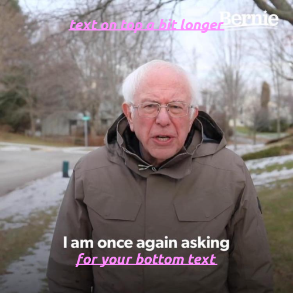
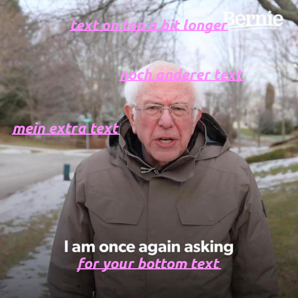

# omm-meme-gen

## API

### Create a single image with bottom/top text

example:

route: http://127.0.0.1:8000/createMeme/

parameters:

| Key | example value | default value |
|---|---|---|
| templateName | bernieAsking | None and returns status 400 |
| topText | text on top a bit longer | "" |
| bottomText | for your bottom text | "" |
| fontSize | 25 | 30 |
| colorHex | ff8cff | #000000 |
| bold | True | False |
| italic | false | False |
| underline | true | False |

as url: <http://127.0.0.1:8000/createMeme/?templateName=bernieAsking&topText=text on top a bit longer&bottomText=for your bottom text&fontSize=25&colorHex=ff8cff&bold=True&italic=true&underline=true>

response content_type = 'image/png':   

### Create a single image with multiple textboxes at chosen locations and text format.

example:

route: http://127.0.0.1:8000/createMeme/

parameters:

| Key | example value | default value |
|---|---|---|
| templateName | bernieAsking | None and returns status 400 |
| topText | text on top a bit longer | "" |
| bottomText | for your bottom text | "" |
| otherTexts | [{"x": 20, "y":200, "text":'mein extra text'}, {'x': 200, 'y': 110, 'text': 'noch anderer text'}] | [] |
| fontSize | 25 | 30 |
| colorHex | ff8cff | #000000 |
| bold | True | False |
| italic | false | False |
| underline | true | False |

as url: <http://127.0.0.1:8000/createMeme/?templateName=bernieAsking&topText=text on top a bit longer&bottomText=for your bottom text&fontSize=25&colorHex=ff8cff&otherTexts=[{"x": 20, "y":200, "text":'mein extra text'}, {'x': 200, 'y': 110, 'text': 'noch anderer text'}]&bold=True&italic=true&underline=true>

response content_type = 'image/png':   

### Create a set of images (provided as a zip file), e.g. from one image but a list of different texts

example:

route: http://127.0.0.1:8000/createMemes/

parameters:

| Key | example value | default value |
|---|---|---|
| templateName | bernieAsking | None and returns status 400 |
| textLists | [[{"x": 20, "y":200, "text":'mein extra text'}, {'x': 200, 'y': 110, 'text': 'noch anderer text'}], [{'x':10,'y':10,'text':'was los'}, {'bottomText': 'for your bottom text'}]] | [], returns status 400 if malformed |
| fontSize | 25 | 30 |
| colorHex | ff8cff | #000000 |
| bold | True | False |
| italic | false | False |
| underline | true | False |

as url: <http://127.0.0.1:8000/createMemes/?templateName=bernieAsking&fontSize=25&colorHex=ff8cff&textLists=[[{"x": 20, "y":200, "text":'mein extra text'}, {'x': 200, 'y': 110, 'text': 'noch anderer text'}], [{'x':10,'y':10,'text':'was los'}, {'bottomText': 'for your bottom text'}]]&bold=True&italic=true&underline=true>

response content_type = 'application/zip':
response: zip containing images named meme0.png, meme1.png, ...

